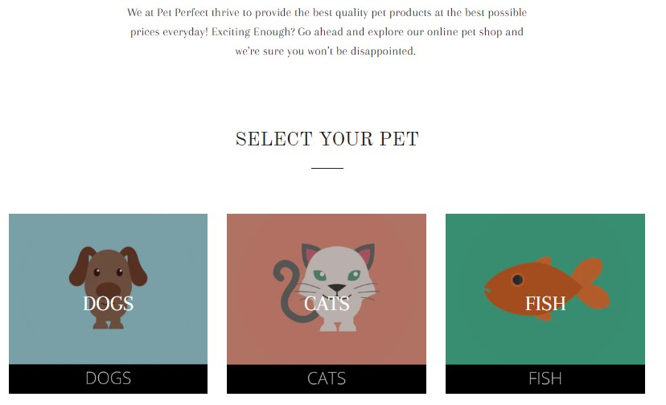

 

  

  <h3 align="center">Pet Store Automation Testing</h3>

  

   Final Project - for the Quality Assurance Training Programm At the Al Hussein Technical University: HTU 
     
     
    <a href="PetPerefct Documentaition (HTU).pdf"><strong>Explore the docs »</strong></a>
    <a href="HTU-Final ProjPresnt.pdf"><strong>Explore the Presentation slides»</strong></a>
     
     
  

## About The Project

This repository contains automated test cases applied on pet-store website.
Dependencies used are selenium java & testNG .

## Tech Tools
- 
- 
- 

## Test Descriptions
### Test 1: Verify Search for Cat
This test verifies the search functionality of the Pet Store website. It performs a search for the keyword "cat" and checks if the displayed items contain the word "cat".

### Test 2: Verify Selecting Random Animal Category and Items Number
This test verifies the selection of a random animal category from the Pet Store website. It randomly selects a pet type from the available options and checks if the number of displayed items is as expected.

### Test 3: Verify Selecting Random Dog Item
This test verifies the selection of a random dog item from the Pet Store website. It navigates to the dogs page, selects a random product, chooses a random color and size, and adds the item to the cart.

### Test 4: Verify Checkout Process and Screenshot Payment Page
This test verifies the checkout process on the Pet Store website. It fills the checkout form with dummy information, proceeds to the payment page, takes a screenshot of the payment page, and checks if the payment header is displayed.

### Test 5: Verify Filling Contact Form and Submit
This test verifies the contact form submission on the Pet Store website. It fills the contact form with dummy information and submits it. It then checks if the success message is displayed.

## Team Members
- **Razan ALfar** [LinkedIn](https://www.linkedin.com/in/razan-alfar/) [Github](https://github.com/RZAlfar) 
- **Neveen Jarrar**  [linkedin](https://www.linkedin.com/in/neveen-jarrar-71b2a31b1/)
- **Hanan Abu-Ra'd** [linkedin](https://www.linkedin.com/in/hanan-abu-ra-d/)
- **Ahmad Abu Yahia**  [linkedin](https://www.linkedin.com/in/ahmad-abu-yahia/) [Github](https://github.com/software-ace) 

###### Instructor : [Abdelraheem Alsaqqa](https://github.com/Asaqa988)
###### Training grant from : [Al Hussein Technical University](https://www.htu.edu.jo/#/)
######       Date : 30 / May / 2023

## 🔗 My LinkedIn

